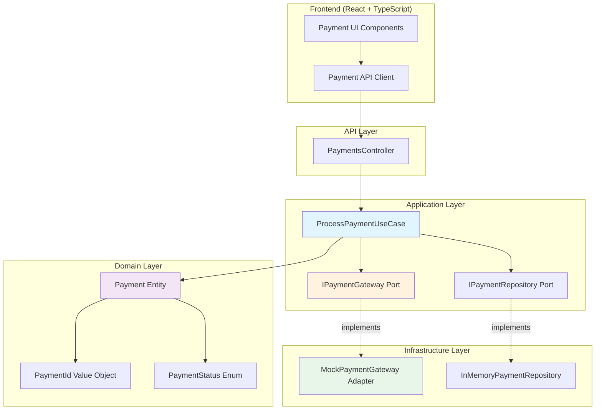
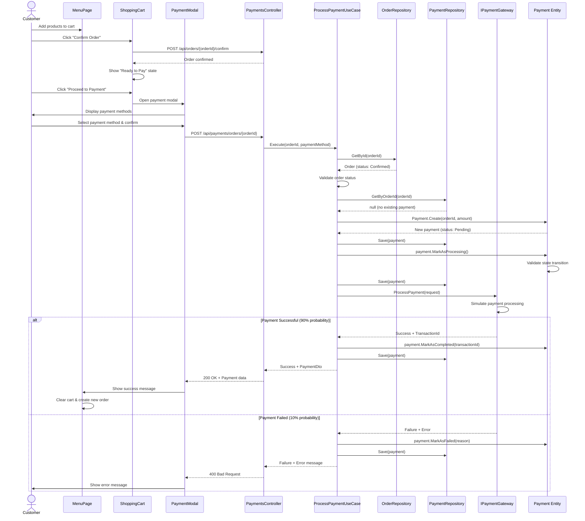
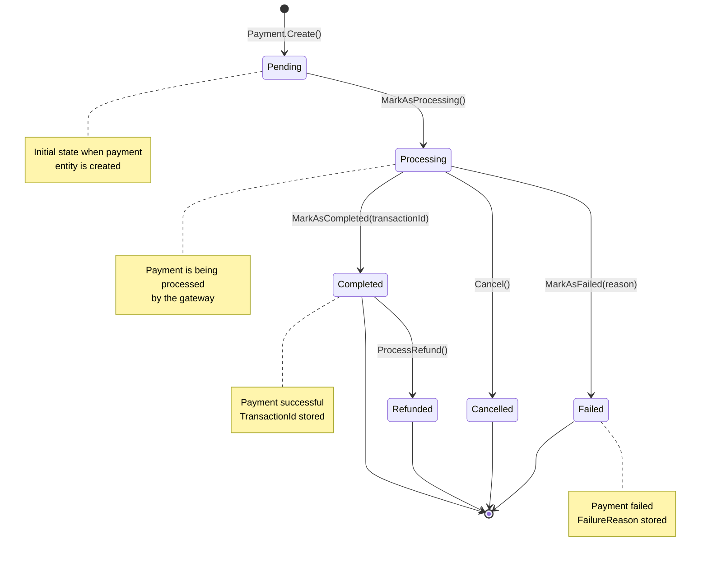
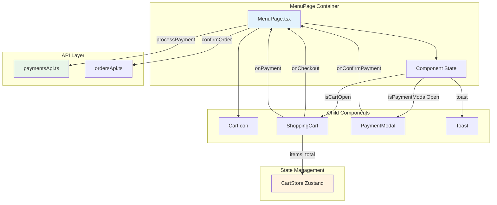
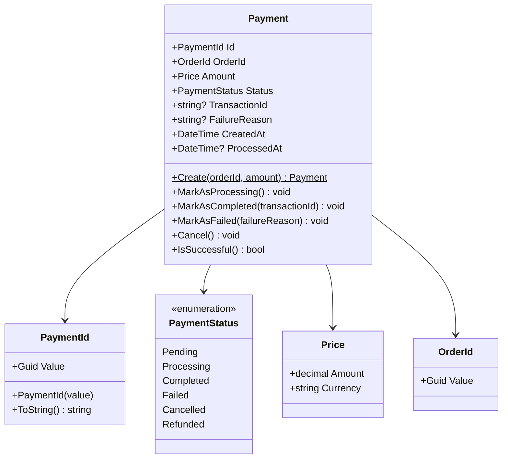

# Payment System - Documentation

## Overview

The Payment System is Phase 5 of the Restaurant WebApp project. It implements a complete payment processing workflow following Clean Architecture, Hexagonal Architecture, and Domain-Driven Design principles.

## Architecture

### Hexagonal Architecture (Ports & Adapters)



**Key Points:**
- **Ports** (`IPaymentGateway`, `IPaymentRepository`) define contracts in the Application layer
- **Adapters** (`MockPaymentGateway`, `InMemoryPaymentRepository`) implement ports in Infrastructure
- **Domain** layer has no dependencies on other layers
- Easy to swap implementations (e.g., replace `MockPaymentGateway` with `StripePaymentGateway`)

---

## Payment Flow Sequence

### Complete End-to-End Flow



---

## Payment State Machine

### State Transitions



**Business Rules:**
1. **Pending → Processing**: Only valid transition from Pending
2. **Processing → Completed**: Requires transaction ID from gateway
3. **Processing → Failed**: Requires failure reason
4. **Processing → Cancelled**: Can be cancelled during processing
5. **Completed → Refunded**: Only completed payments can be refunded
6. **Terminal States**: Failed, Cancelled, Refunded, and Completed (unless refunded)

---

## Component Interaction

### Frontend Component Architecture



**State Flow:**
1. Customer adds items → `CartStore` (Zustand)
2. Customer clicks "Confirm Order" → `onCheckout()` → API call
3. Cart shows "Ready to Pay" → Customer clicks "Proceed to Payment"
4. `PaymentModal` opens → Customer selects method → `onConfirmPayment()`
5. `MenuPage.handlePayment()` → API call → Toast notification
6. On success → Clear cart → Create new order

---

## Domain Model

### Payment Entity



---

## API Endpoints

### POST /api/payments/orders/{orderId}

Process a payment for a confirmed order.

**Request:**
```json
{
  "paymentMethod": "credit_card"
}
```

**Supported Payment Methods:**
- `credit_card`
- `debit_card`
- `cash`

**Success Response (200 OK):**
```json
{
  "success": true,
  "data": {
    "id": "3fa85f64-5717-4562-b3fc-2c963f66afa6",
    "orderId": "7c9e6679-7425-40de-944b-e07fc1f90ae7",
    "amount": 45.50,
    "currency": "EUR",
    "status": "Completed",
    "transactionId": "TXN_abc123",
    "failureReason": null,
    "createdAt": "2025-10-18T16:00:00Z",
    "processedAt": "2025-10-18T16:00:02Z"
  }
}
```

**Failure Response (400 Bad Request):**
```json
{
  "success": false,
  "error": "Payment failed: insufficient_funds"
}
```

**Business Rules:**
1. Order must exist
2. Order must be in `Confirmed` status
3. No successful payment can already exist for the order
4. Payment method must be valid

---

## Testing

### Unit Tests

**Domain Layer Tests:**

1. **PaymentIdTests.cs** (6 tests)
   - ✓ Should create PaymentId with valid GUID
   - ✓ Should throw exception for empty GUID
   - ✓ Two PaymentIds with same value should be equal
   - ✓ ToString should return GUID string
   - ✓ Implicit conversion to GUID works
   - ✓ GetHashCode should be consistent

2. **PaymentTests.cs** (15+ tests)
   - ✓ Create payment with valid data
   - ✓ MarkAsProcessing changes status from Pending
   - ✓ MarkAsCompleted requires transaction ID
   - ✓ MarkAsFailed requires failure reason
   - ✓ Cancel is allowed during processing
   - ✓ Cannot mark as completed if already failed
   - ✓ Cannot transition from terminal states
   - ✓ IsSuccessful returns true only for Completed
   - ✓ ProcessedAt is set when payment completes
   - ✓ State machine enforces business rules

**Run Tests:**
```bash
cd src/backend
dotnet test
```

### Mock Payment Gateway

The `MockPaymentGateway` simulates realistic payment scenarios:

**Configuration:**
```csharp
var gateway = new MockPaymentGateway(logger, successRate: 0.9);
```

**Success Rate:** 90% (configurable)

**Error Codes Simulated:**
- `insufficient_funds` - Customer doesn't have enough money
- `card_declined` - Card rejected by issuer
- `expired_card` - Card expiration date passed
- `invalid_card` - Invalid card number or details
- `processing_error` - Generic processing failure
- `network_timeout` - Timeout during communication

**Network Delay:** Random 100-500ms to simulate real gateway latency

---

## Manual Testing Guide

### Prerequisites
1. Backend running on `http://localhost:5000`
2. Frontend running on `http://localhost:5173`

### Test Scenario 1: Successful Payment

1. Navigate to `http://localhost:5173/menu/5`
2. Add products to cart (e.g., 2x Burger, 1x Soda)
3. Click cart icon → Verify items and total
4. Click "Confirm Order" → Should see green toast "Order confirmed"
5. Cart should show "✓ Order confirmed! Ready to pay."
6. Click "Proceed to Payment"
7. Select payment method (e.g., "Credit Card")
8. Click "Pay XX.XX EUR"
9. Should see "Processing..." state briefly
10. Should see green toast "Payment successful!"
11. Cart should clear automatically
12. New order should be created for the table

**Expected Result:** Full flow completes successfully ~90% of the time

### Test Scenario 2: Failed Payment

1. Repeat steps 1-8 above
2. ~10% of the time, payment will fail
3. Should see red toast "Payment failed: [error_code]"
4. Cart should remain with items
5. Can retry payment
6. Order remains confirmed

**Expected Result:** Error message displayed, order state preserved

### Test Scenario 3: Edge Cases

**Attempt payment without confirming order:**
1. Add items to cart
2. Do NOT click "Confirm Order"
3. "Proceed to Payment" button should NOT be visible

**Attempt payment with empty cart:**
1. Click "Confirm Order" with empty cart
2. Should see warning toast

**Multiple payment attempts:**
1. Confirm order and pay successfully
2. Try to pay again for the same order
3. Backend should reject with "Payment already completed"

---

## Technical Details

### Technology Stack

**Backend:**
- .NET 8
- ASP.NET Core Web API
- xUnit + FluentAssertions + Moq (testing)
- Clean Architecture + DDD

**Frontend:**
- React 18
- TypeScript
- Vite
- Zustand (state management)
- Axios (HTTP client)

### File Structure

```
src/
├── backend/
│   ├── RestaurantApp.Domain/
│   │   ├── Entities/
│   │   │   └── Payment.cs
│   │   └── ValueObjects/
│   │       ├── PaymentId.cs
│   │       └── PaymentStatus.cs
│   ├── RestaurantApp.Application/
│   │   ├── DTOs/
│   │   │   └── PaymentDto.cs
│   │   ├── Ports/
│   │   │   ├── IPaymentGateway.cs
│   │   │   └── IPaymentRepository.cs
│   │   └── UseCases/
│   │       └── ProcessPaymentUseCase.cs
│   ├── RestaurantApp.Infrastructure/
│   │   ├── Adapters/
│   │   │   └── MockPaymentGateway.cs
│   │   └── Repositories/
│   │       └── InMemoryPaymentRepository.cs
│   ├── RestaurantApp.API/
│   │   └── Controllers/
│   │       └── PaymentsController.cs
│   └── RestaurantApp.Tests.Unit/
│       └── Domain/
│           ├── ValueObjects/
│           │   └── PaymentIdTests.cs
│           └── Entities/
│               └── PaymentTests.cs
└── frontend/
    ├── infrastructure/
    │   └── api/
    │       └── paymentsApi.ts
    └── src/
        └── presentation/
            ├── components/
            │   ├── PaymentModal.tsx
            │   └── ShoppingCart.tsx (updated)
            └── pages/
                └── MenuPage.tsx (updated)
```

---

## Design Patterns Used

1. **Hexagonal Architecture (Ports & Adapters)**
   - Ports: `IPaymentGateway`, `IPaymentRepository`
   - Adapters: `MockPaymentGateway`, `InMemoryPaymentRepository`

2. **Repository Pattern**
   - Abstracts data persistence
   - `IPaymentRepository` interface

3. **Factory Pattern**
   - `Payment.Create()` factory method
   - Encapsulates creation logic

4. **State Machine Pattern**
   - Payment entity manages state transitions
   - Validates transitions based on current state

5. **Value Object Pattern**
   - `PaymentId`, `Price`, `OrderId`
   - Immutable, equality by value

6. **Use Case Pattern**
   - `ProcessPaymentUseCase` orchestrates workflow
   - Single responsibility

7. **DTO Pattern**
   - `PaymentDto`, `PaymentRequest`, `PaymentResult`
   - Separates domain from API contracts

---

## Future Enhancements

### Phase 6 Considerations:

1. **Real Payment Gateway Integration**
   - Implement `StripePaymentGateway` adapter
   - Implement `PayPalPaymentGateway` adapter
   - Add webhook handlers for async notifications

2. **Payment Refunds**
   - Add `RefundPaymentUseCase`
   - Implement partial refunds
   - Track refund history

3. **Payment History**
   - Customer payment history view
   - Receipt generation (PDF)
   - Email notifications

4. **Advanced Features**
   - Split payments (multiple payment methods)
   - Tip handling
   - Discount codes
   - Loyalty points integration

5. **Security Enhancements**
   - PCI DSS compliance
   - Tokenization for card data
   - 3D Secure authentication
   - Fraud detection

6. **Monitoring & Analytics**
   - Payment success/failure rates
   - Average processing time
   - Revenue analytics dashboard

---

## Troubleshooting

### Backend Issues

**Port 5000 already in use:**
```bash
# Find process using port 5000
lsof -i :5000
# Kill the process
kill -9 <PID>
```

**Database connection errors:**
- Ensure InMemory repositories are registered in `Program.cs`

**Payment always fails:**
- Check `MockPaymentGateway` success rate configuration
- Review logs for error details

### Frontend Issues

**API calls failing (CORS):**
- Ensure backend has CORS enabled in `Program.cs`
- Check `VITE_API_URL` environment variable

**Cart not clearing after payment:**
- Check browser console for errors
- Verify SignalR connection status

**Payment modal not opening:**
- Ensure order is confirmed first
- Check `orderConfirmed` state in React DevTools

---

## Conclusion

The Payment System (Phase 5) successfully implements a production-ready payment processing workflow with:

✅ Clean Architecture principles
✅ Hexagonal Architecture (Ports & Adapters)
✅ Domain-Driven Design
✅ Comprehensive unit tests
✅ State machine for payment lifecycle
✅ Mock gateway for development
✅ Complete frontend integration
✅ Real-time notifications (SignalR)
✅ Error handling and validation
✅ Extensible design for future enhancements

**Next Steps:** Integrate with real payment gateway (Stripe/PayPal) in Phase 6.
